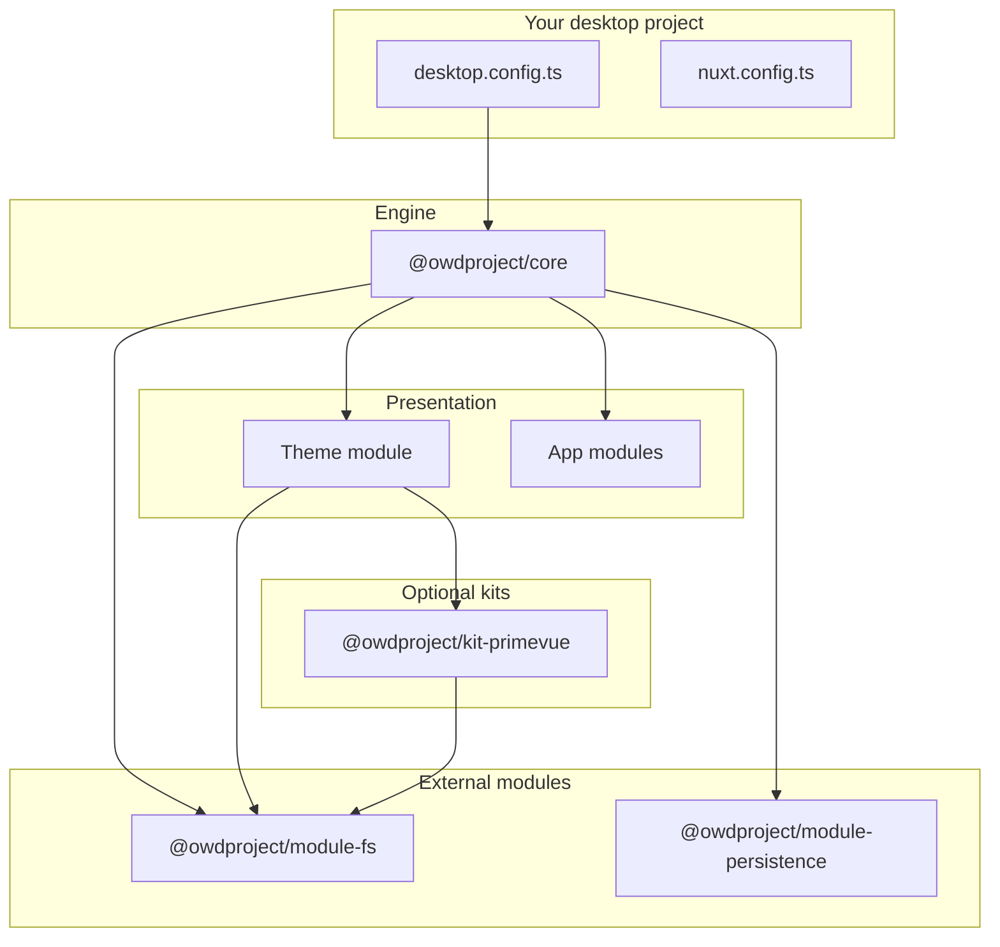

Open Web Desktop (**OWD**) is intentionally split into layers. Keeping them separate is what makes “GNOME vs Windows 95 vs Nova” a **theme problem**, not a rewrite of your apps.

## The engine: `@owdproject/core`

- Loads **`desktop.config.ts`** (legacy **`owd.config.ts`**), validates and **splits** config: **`theme` / `modules` / `apps`** drive **`installModule`**; shell keys merge into **`runtimeConfig.public.desktop`** only.
- Bootstrap order: **Pinia → theme → modules → apps**.
- Owns **window/application lifecycle**, workspace overview, z-order, and composables such as **`useApplicationManager`**, **`useDesktopManager`**, **`useWorkspaceManager`**.
- Ships **kernel Vue components** (`DesktopCore`, `DesktopWindow`, `DesktopApplicationRender`, …): behaviour and slots, not pixel-perfect OS chrome.
- Does **not** ship filesystem explorer UI or ZenFS — those live in **`module-fs`** and **`kit-primevue`**.

If config is missing or invalid, core **fails fast** with an explicit error.

Public contract: **[Kernel contract](/internals/kernel-contract)** (also **`DESKTOP_KERNEL.md`** in the core package).

## Kits (shared, optional)

| Package | Role |
|---------|------|
| **`@owdproject/kit-primevue`** | Installs PrimeVue, Tailwind CSS, configures dialog provider, and supplies PrimeVue-based UI components (e.g. explorer toolbar, file lists). |

Themes that want a PrimeVue-based look depend on **`kit-primevue`**.

## Extension modules (external npm)

| Package | Role |
|---------|------|
| **`@owdproject/module-fs`** | ZenFS virtual filesystem runtime and headless explorer state/stores. |
| **`@owdproject/module-persistence`** | Optional Pinia persistence. |

Not vendored under **`packages/`** in the client repo — install with **`desktop add`**. See [Package linking](/setup/package-linking).

## Themes (pluggable desktop environment)

- Nuxt module: components, styles, boot flow, **`runtimeConfig.public.desktop`** defaults via **defu**.
- Exposes **`Desktop.vue`** as the theme entry; wraps **`DesktopCore`** and kernel window primitives with OS-specific chrome.
- Conditionally loads explorer UI when **`@owdproject/module-fs`** is in the Nuxt module list.

## Apps (Nuxt modules per program)

- Published packages (`dist/module.mjs` via **`@nuxt/module-builder`**).
- Register with **`defineDesktopApp`** (entries, commands, window models).
- Must depend only on **`@owdproject/core`** (peer) and public kit APIs — never on a specific theme.

## Repository map (client monorepo)

| Path | Role |
|------|------|
| **`packages/core`** | Engine module and runtime |
| **`extend/packages/*`** | Extension packages (`kit-primevue`, `module-fs`, `module-persistence`) |
| **`desktop/`** | Reference shell + **`desktop.config.ts`** |
| **`themes/*`** | Local theme clones (gitignored) |
| **`apps/*`** | Local app clones (gitignored) |
| **`template/`** | `npm create owd` output (sync via **`desktop template`**) |
| **`docs/`** | Developer documentation (separate Nuxt site) |
