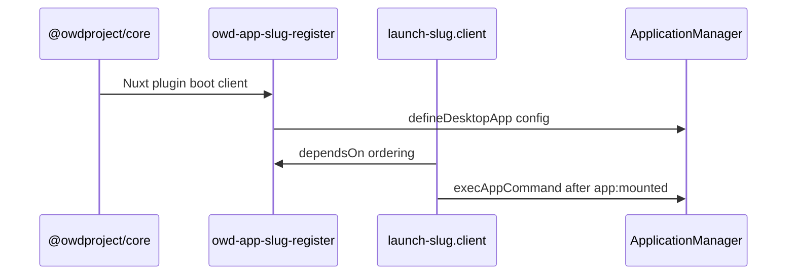

OWD apps use **two different Nuxt plugin layers**. Confusing them is a common source of “app never registered” or “launch runs before register” bugs.

## Overview

| Type | Location | Shipped in npm? | Purpose |
|------|----------|-----------------|---------|
| **Register** | `src/runtime/plugin.ts` | Yes | Calls **`defineDesktopApp`** — makes the app exist in **`useApplicationManager`**. |
| **Launch (dev)** | `playground/app/plugins/launch-*.client.ts` | No | Opens a window automatically in the playground for faster iteration. |



## Register plugin (`src/runtime/plugin.ts`)

Added via **`addPlugin`** in your module’s `setup`. Rules enforced by **`desktop validate`**:

1. Must call **`defineDesktopApp`**.
2. Must set **`name: 'owd-<slug>-register'`** — slug matches your package (e.g. `owd-app-about-register` for `app-about`).
3. Should guard **`if (import.meta.server) return`** — registration is client-only.

```ts
export default defineNuxtPlugin({
  name: 'owd-app-about-register',
  async setup() {
    if (import.meta.server) return
    await defineDesktopApp(config)
  },
})
```

Import **`defineDesktopApp`** from `@owdproject/core/runtime/utils/utilDesktop` (or the path your version exports).

### Why not `app:created`?

Older examples wrapped registration in `nuxtApp.hook('app:created', ...)`. Current reference apps and the validator expect **direct** client-side registration. The register plugin runs during Nuxt plugin initialization on the client bundle.

## Launch plugin (playground only)

Optional but recommended for dev. Filename pattern: **`launch-<slug>.client.ts`**.

```ts
export default defineNuxtPlugin({
  name: 'app-about-playground-launch',
  dependsOn: ['owd-app-about-register'],
  async setup(nuxtApp) {
    if (!import.meta.dev) return
    // wait for app:mounted, retry until isAppDefined, then execAppCommand
  },
})
```

### `dependsOn`

Must list the **exact** register plugin name (`owd-app-about-register`). Without it, launch may run before **`defineDesktopApp`** completes.

### `import.meta.dev`

Always guard launch logic so it never ships in production builds of the playground (and never in the published module artifact — launch files live only under **`playground/`**).

### Retry pattern

Boot order varies (persistence hydrate, theme plugins). Reference apps retry for ~4s after **`app:mounted`**:

```ts
for (let attempt = 0; attempt < 80; attempt++) {
  if (applicationManager.isAppDefined(APP_ID)) {
    await applicationManager.execAppCommand(APP_ID, 'about')
    return
  }
  await new Promise((r) => setTimeout(r, 50))
}
```

Reference: [`app-about` launch plugin](https://github.com/owdproject/app-about/blob/main/playground/app/plugins/launch-about.client.ts).

## Adding plugins from `module.ts`

Only the **register** plugin belongs in the published module:

```ts
addPlugin(resolve('./runtime/plugin'))
```

Do **not** add playground launch plugins from `module.ts` — keep them in **`playground/app/plugins/`** so Nuxt auto-discovers them in the playground app root.

You can add **additional runtime plugins** under `src/runtime/plugins/` if the app needs shared client setup (rare). Register them the same way:

```ts
addPlugin({ src: resolve('./runtime/plugins/10.my-setup.client.ts'), mode: 'client' })
```

Use numeric prefixes (`10.`, `20.`) when order matters relative to other plugins.

## Validation summary

`desktop validate .` on an app repo reports:

| Check | Severity |
|-------|----------|
| Missing `src/runtime/plugin.ts` | error |
| No `defineDesktopApp` | error |
| Wrong plugin `name` pattern | error |
| Missing server guard | warning |
| Missing launch plugin | warning (optional) |

## Related

- [Create from scratch](/apps/create-from-scratch)
- [Playground](/apps/playground)
- Theme-side plugins: [Theme plugins](/themes/plugins)
