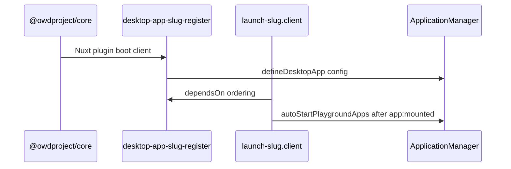

OWD apps use **two different Nuxt plugin layers**. Confusing them is a common source of “app never registered” or “launch runs before register” bugs.

## Overview

| Type | Location | Shipped in npm? | Purpose |
|------|----------|-----------------|---------|
| **Register** | `src/runtime/plugin.ts` | Yes | Calls **`defineDesktopApp`** — makes the app exist in **`useApplicationManager`**. |
| **Launch (dev)** | `playground/app/plugins/launch-*.client.ts` | No | Opens a window automatically in the playground for faster iteration. |



## Register plugin (`src/runtime/plugin.ts`)

Added via **`addPlugin`** in your module’s `setup`. Rules enforced by **`desktop validate`**:

1. Must call **`defineDesktopApp`**.
2. Must set **`name: 'desktop-<slug>-register'`** — slug matches your package (e.g. `desktop-app-about-register` for `app-about`).
3. Should guard **`if (import.meta.server) return`** — registration is client-only.

```ts
export default defineNuxtPlugin({
  name: 'desktop-app-about-register',
  async setup() {
    if (import.meta.server) return
    await defineDesktopApp(config)
  },
})
```

Import **`defineDesktopApp`** from `@owdproject/core/kit/defineDesktopApp`.

### Why not `app:created`?

Older examples wrapped registration in `nuxtApp.hook('app:created', ...)`. Current reference apps and the validator expect **direct** client-side registration. The register plugin runs during Nuxt plugin initialization on the client bundle.

## Launch plugin (playground only)

Optional but recommended for dev and GitHub Pages. Filename pattern: **`launch-<slug>.client.ts`**.

```ts
export default defineNuxtPlugin({
  name: 'app-about-playground-launch',
  dependsOn: ['desktop-app-about-register'],
  setup(nuxtApp) {
    autoStartPlaygroundApps(nuxtApp, [
      { id: 'org.owdproject.about', entry: 'about', windowModel: 'main' },
    ])
  },
})
```

### `dependsOn`

Must list the **exact** register plugin name (`desktop-app-about-register`). Without it, launch may run before **`defineDesktopApp`** completes.

### `autoStartPlaygroundApps`

Use the helper from **`@owdproject/core`** (auto-imported in playground). It:

- Waits for desktop work area measurement (pre-open centering)
- Clears stale persisted windows in playground
- Calls `execAppCommand` with the `entry` string
- Brings the target window to front

The **`entry`** field is the raw command string (e.g. `'about'` or `'youtube --new --no-check'`), not just the entries map key.

### Do not use `import.meta.dev`

Do **not** guard launch with `if (!import.meta.dev) return`. GitHub Pages runs **`nuxt generate`** — the same auto-start path must work there.

Reference: [`app-about` launch plugin](https://github.com/owdproject/app-about/blob/main/playground/app/plugins/launch-about.client.ts).

## Adding plugins from `module.ts`

Only the **register** plugin belongs in the published module:

```ts
addPlugin(resolve('./runtime/plugin'))
```

Do **not** add playground launch plugins from `module.ts` — keep them in **`playground/app/plugins/`** so Nuxt auto-discovers them in the playground app root.

You can add **additional runtime plugins** under `src/runtime/plugins/` if the app needs shared client setup (rare). Register them the same way:

```ts
addPlugin({ src: resolve('./runtime/plugins/10.my-setup.client.ts'), mode: 'client' })
```

Use numeric prefixes (`10.`, `20.`) when order matters relative to other plugins.

## Validation summary

`desktop validate .` on an app repo reports:

| Check | Severity |
|-------|----------|
| Missing `src/runtime/plugin.ts` | error |
| No `defineDesktopApp` | error |
| Wrong plugin `name` pattern (`desktop-*-register`) | error |
| Legacy `owd-*-register` name | error |
| Duplicate `runtime/` + `src/runtime/` | error |
| Missing server guard | warning |
| `import.meta.dev` in launch plugin | warning |
| Launch without `autoStartPlaygroundApps` | warning |
| Hardcoded `position` in app.config | warning |
| Missing launch plugin | warning (optional) |

Full list: [core PLAYGROUND.md](https://github.com/owdproject/core/blob/main/PLAYGROUND.md).

## Related

- [Create from scratch](/apps/create-from-scratch)
- [Playground](/apps/playground)
- Theme-side plugins: [Theme plugins](/themes/plugins)
