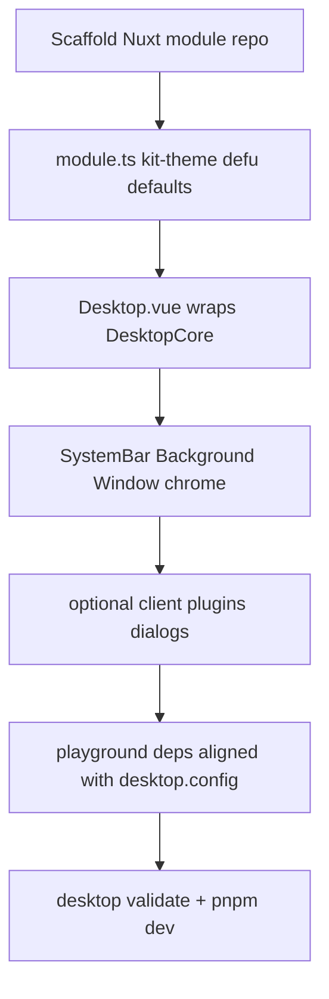

---

## title: Create from scratch
description: End-to-end guide to building an OWD theme — minimal Paper vs full Nova, playground deps, PrimeVue.
navigation:
  icon: i-lucide-list-checks

This guide walks through creating a theme module from zero. Compare `**[theme-paper](https://github.com/owdproject/theme-paper)**` (minimal) and `**[theme-nova](https://github.com/owdproject/theme-nova)**` (full shell).




## Paper vs Nova at a glance


| Aspect                        | Paper (minimal)    | Nova (full)                                                               |
| ----------------------------- | ------------------ | ------------------------------------------------------------------------- |
| `**@owdproject/kit-theme**`   | Yes                | Yes                                                                       |
| `**defaults` + `defu**`       | Small shell config | systemBar, dockBar, explorer flags                                        |
| **Extra plugins**             | None or minimal    | `50.desktop-theme-nova-dialogs.client.ts`                                 |
| `**Desktop.vue`**             | Simple layout      | Full shell + slots                                                        |
| **Explorer UI**               | No                 | Conditional on `@owdproject/module-fs`                                    |
| **Direct `primevue` imports** | Unlikely           | Yes (ContextMenu, DataTable, …)                                           |
| **Boot pages**                | No                 | Optional — see `[theme-win95](https://github.com/owdproject/theme-win95)` |


## 1. Scaffold the repository

Typical tree:

```text
@owdproject/theme-mytheme/
├── package.json
├── src/
│   ├── module.ts
│   └── runtime/
│       ├── components/
│       │   ├── Desktop.vue
│       │   ├── SystemBar.vue
│       │   ├── Background.vue
│       │   └── Window/
│       ├── composables/
│       └── plugins/          # optional client plugins
├── playground/
│   ├── nuxt.config.ts
│   ├── desktop.config.ts
│   └── package.json
└── dist/
```

`**peerDependencies`:**

```json
{
  "@owdproject/core": "^3.4.0",
  "@owdproject/kit-primevue": "^3.4.0",
  "nuxt": "^4.4.4"
}
```

## 2. Write `src/module.ts`

::callout{icon="i-lucide-arrow-right-left"}
**Since core 3.3.2:** use **`defineDesktopTheme`** instead of hand-rolling `defu` on `public.desktop`. See **[Migrate packages (3.3.2)](/setup/migrate-packages-3.3.2)**.
::

Minimal pattern (Paper-like):

```ts
import { createResolver, addComponentsDir } from '@nuxt/kit'
import { installModule } from '@nuxt/kit'
import { defineDesktopTheme } from '@owdproject/core/kit/authoring'
import { registerThemeTailwindPath } from '@owdproject/kit-primevue/kit/registerTailwindPath'

export default defineDesktopTheme({
  meta: { name: 'owd-theme-mytheme' },
  defaults: {
    name: 'mytheme',
    systemBar: { enabled: true, position: 'top', startButton: true },
  },
  async setup(_options, nuxt) {
    const { resolve } = createResolver(import.meta.url)

    await installModule('@owdproject/kit-primevue')
    registerThemeTailwindPath(nuxt, import.meta.url)

    addComponentsDir({ path: resolve('./runtime/components'), global: true })
  },
})
```

Nova adds:

- PrimeVue preset options on `nuxt.options.primevue`
- `**addPlugin({ src: resolve('./runtime/plugins/50....client.ts'), mode: 'client' })**`
- Conditional `**installModule('@owdproject/kit-primevue')**` when `module-fs` is loaded

See [Theme anatomy](/themes/theme-anatomy) and [Theme plugins](/themes/plugins).

## 3. Implement `Desktop.vue`

The theme root wraps `**DesktopCore**` from core — see [Theme anatomy — Desktop.vue](/themes/theme-anatomy#desktopvue).

Consumer `**app.vue**` renders `**<Desktop />**` (auto-imported globally from your components dir).

## 4. Window and shell components


| Component         | Role                                              |
| ----------------- | ------------------------------------------------- |
| `**Window*.vue**` | Chrome around `**DesktopWindow**` / content slots |
| `**SystemBar**`   | Taskbar / menu bar                                |
| `**Background**`  | Wallpaper / desktop surface                       |
| `**DockBar**`     | Optional (Nova)                                   |


Apps render **inside** window content areas — keep window wrappers in the theme, business UI in apps.

## 5. Add theme plugins (Nova / Win95)

Dialog confirmation flows use a **client plugin** registered from `module.ts`:

```ts
addPlugin({
  src: resolve('./runtime/plugins/50.desktop-theme-nova-dialogs.client.ts'),
  mode: 'client',
})
```

Details: [Theme plugins](/themes/plugins).

## 6. Configure the playground

`**playground/nuxt.config.ts`:**

```ts
export default defineNuxtConfig({
  modules: ['@owdproject/core'],
  ssr: false,
  compatibilityDate: 'latest',
})
```

`**playground/desktop.config.ts**` (Nova demo):

```ts
import { defineDesktopConfig } from '@owdproject/core'

export default defineDesktopConfig({
  theme: '@owdproject/theme-nova',
  modules: ['@owdproject/module-fs'],
  apps: ['@owdproject/app-classic-audioplayer'],
  systemBar: { enabled: true, startButton: true },
  fs: {
    mounts: { '/mnt/test': '/test-small.zip' },
  },
})
```

`**playground/package.json**` must list **every** dependency above, plus PrimeVue when the theme imports it:

```json
{
  "dependencies": {
    "@owdproject/app-classic-audioplayer": "^3.4.0",
    "@owdproject/core": "^3.4.0",
    "@owdproject/module-fs": "^3.4.0",
    "@owdproject/module-persistence": "^3.4.0",
    "@owdproject/theme-nova": "^3.4.0",
    "@primeuix/themes": "^2.0.3",
    "nuxt": "^4.4.4",
    "primevue": "^4.5.5"
  }
}
```

### Why `primevue` explicitly?

While `@owdproject/kit-primevue` configures PrimeVue during boot, themes that import `primevue/...` components directly in their templates must declare `primevue` and `@primeuix/themes` as `peerDependencies` (and have them in playground dependencies for local development) to ensure pnpm resolves them correctly.

Reference upstream: `[theme-nova` playground](https://github.com/owdproject/theme-nova/blob/main/playground/package.json) — add PrimeVue packages if missing locally.

```bash
cd playground && pnpm install && pnpm dev
```

## 7. Validate

```bash
desktop validate .
```

Wire into **client/desktop** with `workspace:*` when developing inside the monorepo.

## Boot flow (Win95)

For start/boot screens, add `**runtime/pages/`** routes and composables like `**useSystemLifecycle**`. See [Pages and boot flow](/themes/pages-and-boot-flow) and `[theme-win95](https://github.com/owdproject/theme-win95)`.

## Known issues


| Issue                                            | Workaround                                                         |
| ------------------------------------------------ | ------------------------------------------------------------------ |
| `primevue` not found in playground               | Add `primevue` + `@primeuix/themes` to playground deps             |
| `desktop.config` lists modules not in playground | Align `package.json` with every `apps` / `modules` / `theme` entry |


## Next

- [Theme anatomy](/themes/theme-anatomy)
- [Theme plugins](/themes/plugins)
- [Styling and Tailwind](/themes/styling-and-tailwind)

