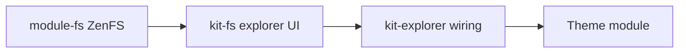

Themes stay **installable without** a virtual filesystem. Heavy features gate on whether the user added **`@owdproject/module-fs`** to **`desktop.config.ts`**.

## Layering



- **`module-fs`** — VFS runtime, composables like **`useFileSystemExplorer`**.
- **`kit-fs`** — neutral explorer components + **`useExplorerStore`**.
- **`kit-explorer`** — shared explorer app integration; theme adds its own nav pane / chrome.

Core **does not** include explorer UI as of **3.3** — do not import **`useDesktopExplorerStore`** from core; use **`useExplorerStore`** from **`kit-fs`**.

## Conditional pattern

```ts
if (nuxt.options.modules.includes('@owdproject/module-fs')) {
  await installModule('@owdproject/kit-explorer')

  addPlugin({ src: resolve('./runtime/apps/explorer/plugin.ts'), mode: 'client' })
  addComponentsDir({ path: resolve('./runtime/apps/explorer/components') })
}
```

Benefits:

- **Lighter** desktop when the user skips filesystem modules.
- **Self-contained** theme demos when the playground lists **`module-fs`** in config.

## Dependencies in `package.json`

| Style | When |
|-------|------|
| **`@owdproject/kit-theme`**: npm **`^0.0.1`** | Standalone theme repo / publish |
| **`workspace:*`** for kits | Theme cloned under client **`themes/*`** |
| **No `module-fs` in theme `dependencies`** | Prefer playground + user desktop to add **`module-fs`** via npm |

Do **not** use **`workspace:*`** for **`module-fs`** unless you cloned it into the workspace with **`desktop add module-fs --dev`**.

## Coupling checklist for theme README

Document:

- Which **optional modules** unlock explorer / media apps.
- **`peerDependencies`** on **`@owdproject/core`** version.
- Behaviour **without** **`module-fs`** (explorer entries hidden vs disabled).

## Related

- [Package linking](/setup/package-linking)
- [Theme anatomy](/themes/theme-anatomy)
