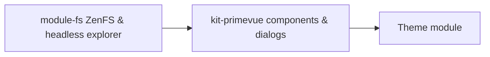

Themes stay **installable without** a virtual filesystem. Heavy features gate on whether the user added **`@owdproject/module-fs`** to **`desktop.config.ts`**.

## Layering



- **`module-fs`** — ZenFS virtual filesystem runtime and headless explorer state/stores (`useExplorerStore`, `useExplorerWindow`).
- **`kit-primevue`** — Nuxt PrimeVue configuration, dialog provider bridge, and UI explorer components (Workspace, Toolbar, FileEntry).

Core does **not** include explorer UI — do not import `useDesktopExplorerStore` from core; use **`useExplorerStore`** from `@owdproject/module-fs`.

## Conditional pattern

Themes can conditionally register filesystem-dependent components or plugins based on whether `@owdproject/module-fs` is active:

```ts
if (nuxt.options.modules.includes('@owdproject/module-fs')) {
  // Add explorer-specific theme components or custom plugins
  addPlugin({ src: resolve('./runtime/apps/explorer/plugin.ts'), mode: 'client' })
  addComponentsDir({ path: resolve('./runtime/apps/explorer/components') })
}
```

Benefits:

- **Lighter** desktop when the user skips filesystem modules.
- **Self-contained** theme demos when the playground lists **`module-fs`** in config.

## Dependencies in `package.json`

| Style | When |
|-------|------|
| **`@owdproject/kit-primevue`**: npm **`^3.4.0`** | Standalone theme repo / publish |
| **`workspace:*`** for kits | Theme cloned under client **`themes/*`** |
| **No `module-fs` in theme `dependencies`** | Prefer playground + user desktop to add **`module-fs`** via npm |

Do **not** use **`workspace:*`** for **`module-fs`** unless you cloned it into the workspace with **`desktop add module-fs --dev`**.

When the playground enables explorer demos, align **`playground/package.json`** with **`desktop.config.ts`** — see [Create from scratch](/themes/create-from-scratch).

## Coupling checklist for theme README

Document:

- Which **optional modules** unlock explorer / media apps.
- **`peerDependencies`** on **`@owdproject/core`** version.
- Behaviour **without** **`module-fs`** (explorer entries hidden vs disabled).

## Related

- [Package linking](/setup/package-linking)
- [Theme anatomy](/themes/theme-anatomy)
- [Create from scratch](/themes/create-from-scratch)
